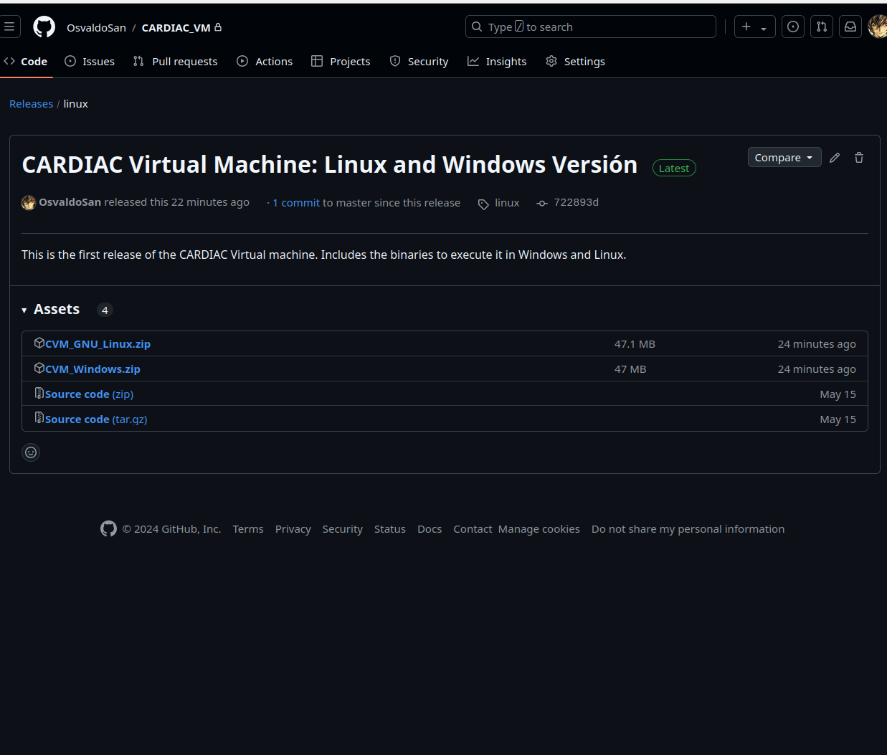
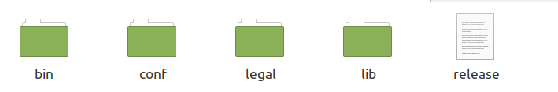
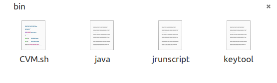
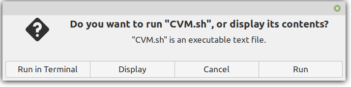
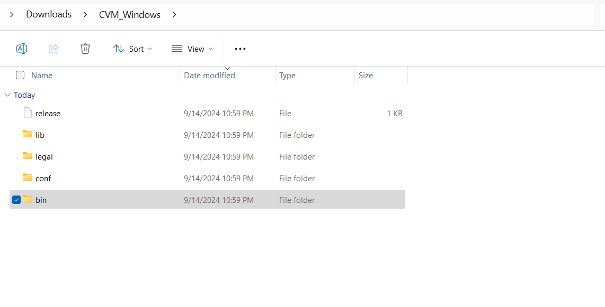
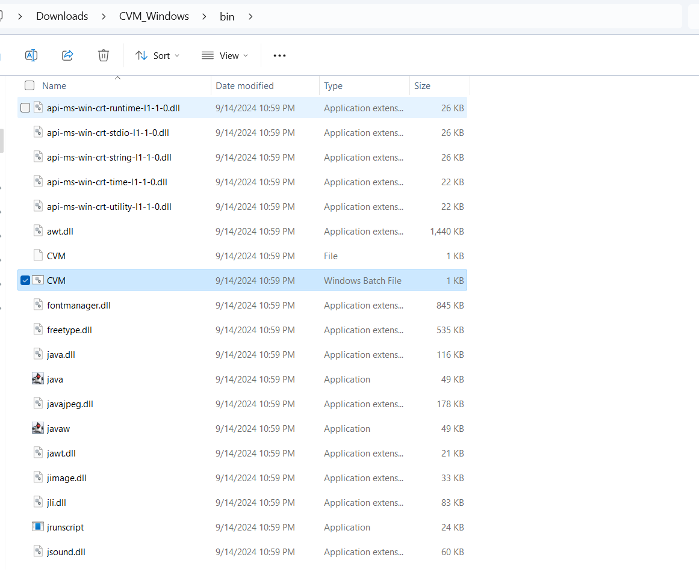
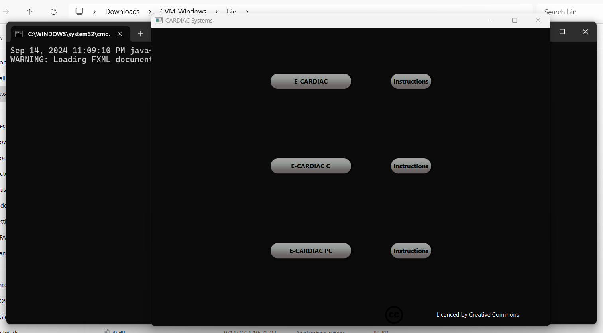

# Máquina Virtual CARDIAC: Un modelo didáctico para la computación

Esta es una máquina virtual diseñada para explorar la computación concurrente y paralela utilizando el reconocido modelo CARDIAC, creado por David Hagelbarger y Saul Fingerman.

Esta aplicación fue creada para la tesis: **CARDIAC: La evolución hacia un modelo concurrente y paralelo**, y está destinada a asistir a cualquier estudiante que la necesite.

# ¿Cómo Usar Esta Aplicación?

## Opción Binaria

Para usar esta versión en Windows o Linux, necesitas instalar la versión más reciente del Entorno de Ejecución de Java. Puedes encontrarla en [Java](https://www.java.com/en/).

Para buscar los binarios ve al [repositorio](https://github.com/OsvaldoSan/CARDIAC_VM) y haz clic en la sección *releases*.

  

Una vez que hayas hecho clic allí, verás la siguiente imagen:

  

Aquí podrás ver dos archivos zip que contienen el código binario para ejecutar el programa en Windows y GNU/Linux. Descarga la versión adecuada para tu sistema operativo.

### Opción Binaria: Linux

Si descargas la versión para Linux, necesitas descomprimir el archivo, y verás las siguientes carpetas:

  

Estas carpetas contienen toda la información necesaria para que el programa funcione. Luego, ve a la carpeta llamada *bin*, donde verás los siguientes archivos:

  

A continuación, necesitas ejecutar el archivo llamado **CVM.sh**. Puedes ejecutarlo desde el explorador de archivos haciendo doble clic en él, lo que mostrará el siguiente diálogo. Aquí, haz clic en "RUN".

  

Si encuentras algún problema con esto, otra opción es ejecutarlo desde la línea de comandos del terminal con el siguiente comando:

  

Después de eso, verás que el programa se inicia:

  

Las instrucciones sobre cómo usar la máquina virtual se encuentran en el PDF incluido en el repositorio. Este PDF hace referencia a la tesis para este proyecto.

### Opción Binaria: Windows

Si usas la opción para Windows, después de descargar y extraer el archivo **CVM_Windows.zip**, verás las siguientes carpetas:

  

Estas carpetas contienen toda la información necesaria para que la aplicación funcione correctamente. Para ejecutar la aplicación, ve a la carpeta *bin*, donde verás varios archivos. Busca el archivo llamado *CVM*, que es un archivo tipo *Windows Batch File* como se muestra en la imagen:

  

Una vez que hayas identificado el archivo, simplemente haz doble clic en él, y se abrirá una ventana de *CMD* que iniciará la ventana principal de *CARDIAC*.

  

Las instrucciones sobre cómo usar la máquina virtual se encuentran en el PDF incluido en el repositorio. Este PDF hace referencia a la tesis para este proyecto.

\clearpage

## Crear un Ejecutable con el Código Fuente

Si prefieres crear un ejecutable a partir del código fuente, puedes hacerlo. Primero, accede al repositorio [CARDIAC_VM](https://github.com/OsvaldoSan/CARDIAC_VM) y clona el código.

Luego, simplemente sigue las reglas del framework [Apache Maven](https://maven.apache.org/) y edita el archivo *pom* según tus especificaciones.

Aquí tienes un ejemplo de lo fácil que es desplegar la aplicación usando Maven en el terminal de Linux:

  

Una de las mejores cosas de usar Maven para desplegar la aplicación es que, dependiendo del sistema operativo que utilices, se creará el archivo binario correspondiente. Así que, si deseas un binario para Windows, necesitarás desplegar la aplicación en un sistema de archivos de Windows.

Para más información, visita [Apache Maven](https://maven.apache.org/).

